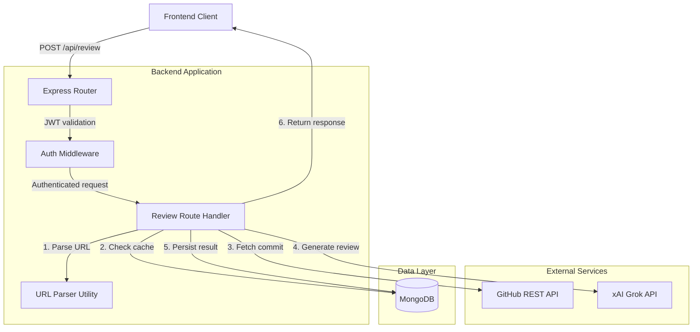
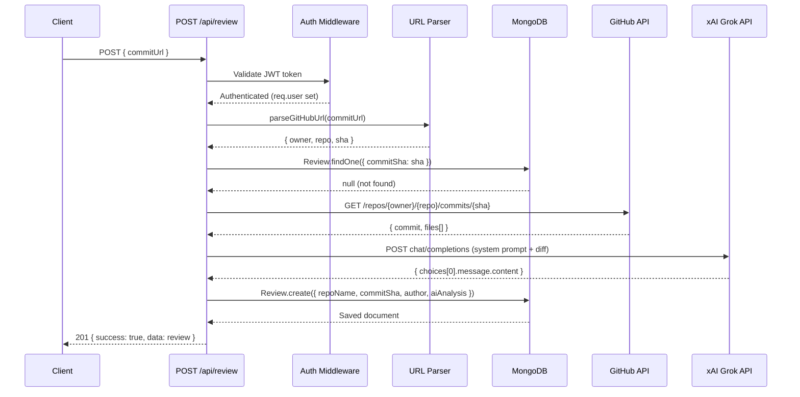
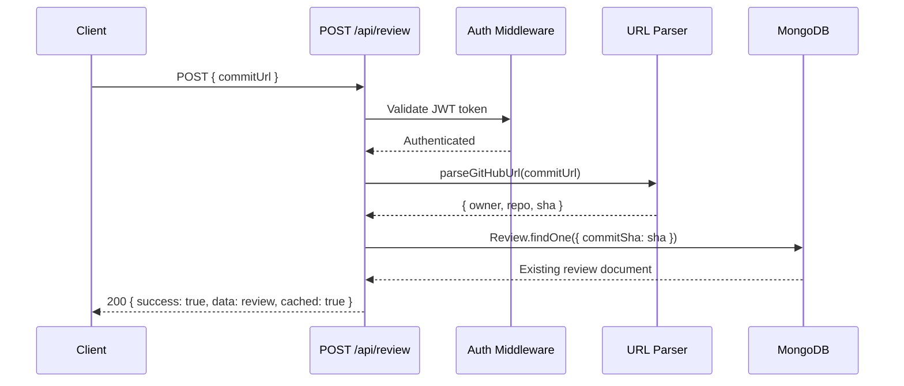

# Design Document: Commit Review API

## Overview

The Commit Review API is a POST endpoint (`/api/review`) that accepts a public GitHub commit URL, fetches the commit's diff data from GitHub's REST API, sends it to the xAI Grok model for AI-powered code review, and persists the result in MongoDB. A caching layer checks if the commit has already been reviewed to avoid redundant API calls, returning the stored review immediately when available.

This feature integrates three external systems — GitHub's public API for commit data retrieval, xAI's Grok LLM for intelligent code analysis, and MongoDB for persistence and caching. The route handler orchestrates these interactions in a linear pipeline with early-return optimization for cached results.

## Architecture



## Sequence Diagrams

### Main Flow: New Commit Review (Cache Miss)



### Cache Hit Flow (Existing Review)



## Components and Interfaces

### Component 1: Review Route Handler (`routes/review.js`)

**Purpose**: Express router that orchestrates the entire commit review pipeline.

**Interface**:
```javascript
const router = express.Router();

// POST /api/review
// Protected by auth middleware
// Body: { commitUrl: string }
// Returns: { success: boolean, data: ReviewDocument, cached?: boolean }
router.post('/', protect, async (req, res) => { /* ... */ });

module.exports = router;
```

**Responsibilities**:
- Validate request body contains a valid GitHub commit URL
- Orchestrate the parse → cache-check → fetch → analyze → persist pipeline
- Return appropriate HTTP status codes and error messages
- Handle all error scenarios gracefully

### Component 2: URL Parser Utility (`utils/parseGitHubUrl.js`)

**Purpose**: Extracts owner, repo, and commit SHA from a GitHub commit URL.

**Interface**:
```javascript
/**
 * @param {string} url - GitHub commit URL
 * @returns {{ owner: string, repo: string, sha: string }}
 * @throws {Error} If URL format is invalid
 */
function parseGitHubUrl(url) { /* ... */ }

module.exports = parseGitHubUrl;
```

**Responsibilities**:
- Parse URLs matching pattern: `https://github.com/{owner}/{repo}/commit/{sha}`
- Validate SHA format (40-character hex string)
- Throw descriptive errors for malformed URLs

### Component 3: GitHub Service (`services/github.js`)

**Purpose**: Fetches commit details from GitHub's public REST API.

**Interface**:
```javascript
/**
 * @param {string} owner - Repository owner
 * @param {string} repo - Repository name
 * @param {string} sha - Commit SHA
 * @returns {Promise<{ message: string, author: string, files: Array<{ filename: string, patch: string }> }>}
 * @throws {Error} If GitHub API request fails
 */
async function fetchCommitDetails(owner, repo, sha) { /* ... */ }

module.exports = { fetchCommitDetails };
```

**Responsibilities**:
- Make authenticated or unauthenticated GET request to GitHub API
- Extract relevant fields (commit message, author, files with patches)
- Handle rate limiting and API errors

### Component 4: Grok AI Service (`services/grok.js`)

**Purpose**: Sends diff content to xAI Grok for AI-powered code review.

**Interface**:
```javascript
/**
 * @param {string} diffContent - Formatted diff/patch content from commit files
 * @param {string} commitMessage - The commit message for context
 * @returns {Promise<string>} Markdown-formatted AI review
 * @throws {Error} If Grok API request fails
 */
async function generateReview(diffContent, commitMessage) { /* ... */ }

module.exports = { generateReview };
```

**Responsibilities**:
- Format diff content into a structured prompt
- Send request to xAI Grok API (OpenAI-compatible endpoint)
- Return the markdown review content
- Handle token limits and API errors

## Data Models

### Review Model (Existing — `models/Review.js`)

```javascript
const reviewSchema = new mongoose.Schema({
  repoName: { type: String, required: true },
  commitSha: { type: String, required: true, unique: true, index: true },
  author: { type: String, required: true },
  aiAnalysis: { type: String },
  createdAt: { type: Date, default: Date.now }
});
```

**Validation Rules**:
- `commitSha` must be unique (enforced by MongoDB unique index)
- `repoName` format: `owner/repo`
- `author` extracted from GitHub commit data
- `aiAnalysis` stores the full markdown review from Grok

### Request Schema

```javascript
// POST /api/review request body
{
  commitUrl: "https://github.com/{owner}/{repo}/commit/{sha}"  // Required, valid GitHub commit URL
}
```

### Response Schema

```javascript
// Success response (new review)
{
  success: true,
  data: {
    _id: "ObjectId",
    repoName: "owner/repo",
    commitSha: "abc123...def",
    author: "username",
    aiAnalysis: "## Executive Summary\n...",
    createdAt: "2024-01-01T00:00:00.000Z"
  }
}

// Success response (cached)
{
  success: true,
  data: { /* same as above */ },
  cached: true
}

// Error response
{
  success: false,
  error: "Description of what went wrong"
}
```

## Algorithmic Pseudocode

### Main Processing Algorithm: Review Pipeline

```javascript
// ALGORITHM: processCommitReview
// INPUT: req (Express request with body.commitUrl), res (Express response)
// OUTPUT: JSON response with review data or error

async function processCommitReview(req, res) {
  // Step 1: Validate input
  const { commitUrl } = req.body;
  ASSERT commitUrl is defined AND is non-empty string;

  // Step 2: Parse the GitHub URL
  const { owner, repo, sha } = parseGitHubUrl(commitUrl);
  ASSERT owner is non-empty string;
  ASSERT repo is non-empty string;
  ASSERT sha matches /^[a-f0-9]{40}$/;

  // Step 3: Check MongoDB cache
  const existingReview = await Review.findOne({ commitSha: sha });
  IF existingReview !== null THEN
    RETURN res.status(200).json({ success: true, data: existingReview, cached: true });
  END IF

  // Step 4: Fetch commit from GitHub API
  const commitData = await fetchCommitDetails(owner, repo, sha);
  ASSERT commitData.files is Array with length > 0;

  // Step 5: Format diff content for Grok
  const diffContent = formatDiffForPrompt(commitData.files);

  // Step 6: Generate AI review via Grok
  const aiAnalysis = await generateReview(diffContent, commitData.message);
  ASSERT aiAnalysis is non-empty string;

  // Step 7: Persist to MongoDB
  const review = await Review.create({
    repoName: `${owner}/${repo}`,
    commitSha: sha,
    author: commitData.author,
    aiAnalysis: aiAnalysis
  });

  // Step 8: Return response
  RETURN res.status(201).json({ success: true, data: review });
}
```

**Preconditions:**
- MongoDB connection is established
- `req.body.commitUrl` is provided in request body
- User is authenticated (JWT validated by auth middleware)
- Environment variables for API keys are configured

**Postconditions:**
- If cached: returns existing document, no external API calls made
- If new: review document is persisted in MongoDB with unique commitSha
- Response always contains `success` boolean and either `data` or `error`

### URL Parsing Algorithm

```javascript
// ALGORITHM: parseGitHubUrl
// INPUT: url (string) — a GitHub commit URL
// OUTPUT: { owner: string, repo: string, sha: string }
// THROWS: Error if URL format is invalid

function parseGitHubUrl(url) {
  // Expected format: https://github.com/{owner}/{repo}/commit/{sha}
  const pattern = /^https?:\/\/github\.com\/([^/]+)\/([^/]+)\/commit\/([a-f0-9]{40})$/i;

  const match = url.match(pattern);
  IF match === null THEN
    THROW new Error('Invalid GitHub commit URL format');
  END IF

  const [, owner, repo, sha] = match;

  RETURN { owner, repo, sha };
}
```

**Preconditions:**
- `url` is a non-null, non-empty string

**Postconditions:**
- Returns object with `owner`, `repo`, `sha` — all non-empty strings
- `sha` is exactly 40 hexadecimal characters
- Throws descriptive Error if URL doesn't match expected pattern

### Diff Formatting Algorithm

```javascript
// ALGORITHM: formatDiffForPrompt
// INPUT: files (Array of { filename, patch })
// OUTPUT: formatted string suitable for LLM prompt

function formatDiffForPrompt(files) {
  let formatted = '';

  FOR each file IN files DO
    IF file.patch is defined THEN
      formatted += `\n--- File: ${file.filename} ---\n`;
      formatted += file.patch;
      formatted += '\n';
    END IF
  END FOR

  // Truncate if exceeding token budget (~100k chars ≈ 25k tokens)
  IF formatted.length > 100000 THEN
    formatted = formatted.substring(0, 100000);
    formatted += '\n\n[TRUNCATED: Diff too large for single review]';
  END IF

  RETURN formatted;
}
```

**Preconditions:**
- `files` is a non-null array
- Each file object has at minimum a `filename` property

**Postconditions:**
- Returns a string (may be empty if no patches exist)
- Output length never exceeds 100,000 + truncation message length
- Each file section is clearly delimited with filename headers

**Loop Invariants:**
- `formatted` contains all patches from files processed so far
- Each file section is properly delimited

## Key Functions with Formal Specifications

### Function 1: `parseGitHubUrl(url)`

```javascript
function parseGitHubUrl(url) {
  const pattern = /^https?:\/\/github\.com\/([^/]+)\/([^/]+)\/commit\/([a-f0-9]{40})$/i;
  const match = url.match(pattern);
  if (!match) {
    throw new Error('Invalid GitHub commit URL. Expected: https://github.com/{owner}/{repo}/commit/{sha}');
  }
  return { owner: match[1], repo: match[2], sha: match[3] };
}
```

**Preconditions:**
- `url` is a string (non-null)

**Postconditions:**
- Returns `{ owner, repo, sha }` where all are non-empty strings
- `sha` is 40 hex characters (lowercase)
- Throws Error with descriptive message if format invalid

### Function 2: `fetchCommitDetails(owner, repo, sha)`

```javascript
async function fetchCommitDetails(owner, repo, sha) {
  const response = await axios.get(
    `https://api.github.com/repos/${owner}/${repo}/commits/${sha}`,
    {
      headers: {
        'Accept': 'application/vnd.github.v3+json',
        'User-Agent': 'GitGroq-App'
      }
    }
  );
  return {
    message: response.data.commit.message,
    author: response.data.commit.author.name,
    files: response.data.files || []
  };
}
```

**Preconditions:**
- `owner`, `repo`, `sha` are valid non-empty strings
- Network connectivity to api.github.com is available
- Commit exists in the specified public repository

**Postconditions:**
- Returns object with `message` (string), `author` (string), `files` (array)
- `files` array contains objects with `filename` and `patch` properties
- Throws axios error if request fails (404, rate limit, network error)

### Function 3: `generateReview(diffContent, commitMessage)`

```javascript
async function generateReview(diffContent, commitMessage) {
  const response = await axios.post(
    'https://api.x.ai/v1/chat/completions',
    {
      model: 'grok-3-mini',
      messages: [
        { role: 'system', content: SYSTEM_PROMPT },
        { role: 'user', content: `Commit Message: ${commitMessage}\n\nDiff:\n${diffContent}` }
      ],
      temperature: 0.3
    },
    {
      headers: {
        'Authorization': `Bearer ${process.env.XAI_API_KEY}`,
        'Content-Type': 'application/json'
      }
    }
  );
  return response.data.choices[0].message.content;
}
```

**Preconditions:**
- `diffContent` is a non-empty string containing formatted patches
- `commitMessage` is a string (may be empty)
- `process.env.XAI_API_KEY` is configured and valid
- Network connectivity to xAI API endpoint

**Postconditions:**
- Returns a non-empty markdown string containing the structured review
- Review contains: Executive Summary, Line-by-Line Explanation, Bug/Vulnerability Analysis
- Throws error if API key invalid, rate limited, or network failure

### Function 4: Grok System Prompt

```javascript
const SYSTEM_PROMPT = `You are an expert code reviewer. Analyze the following git commit diff and provide a comprehensive review in markdown format.

Your review MUST follow this exact structure:

## Executive Summary
Provide a 2-3 sentence overview of what this commit does, its purpose, and overall quality assessment.

## Line-by-Line Explanation
For each modified file, explain:
- What changed and why
- The logic behind each significant modification
- Any patterns or techniques used

## Bugs & Vulnerabilities
Identify any:
- Potential bugs or logic errors
- Security vulnerabilities (injection, XSS, auth issues, etc.)
- Performance concerns
- Race conditions or concurrency issues
- Missing error handling
- Code smell or anti-patterns

Rate severity as: 🔴 Critical | 🟡 Warning | 🟢 Suggestion

If no issues found, state "No significant issues detected."

Be specific, reference line numbers from the diff, and provide actionable suggestions.`;
```

## Example Usage

```javascript
// Example 1: Successful new review
const axios = require('axios');

const response = await axios.post('http://localhost:5000/api/review', {
  commitUrl: 'https://github.com/expressjs/express/commit/5ab3a4f0b4c8f573ef949f3e4e3c0f1a2b3c4d5e'
}, {
  headers: { 'Authorization': 'Bearer <jwt_token>' }
});

// response.data:
// {
//   success: true,
//   data: {
//     _id: "665a...",
//     repoName: "expressjs/express",
//     commitSha: "5ab3a4f0b4c8f573ef949f3e4e3c0f1a2b3c4d5e",
//     author: "John Doe",
//     aiAnalysis: "## Executive Summary\n...",
//     createdAt: "2024-06-01T..."
//   }
// }

// Example 2: Cached review (same commit URL again)
const cachedResponse = await axios.post('http://localhost:5000/api/review', {
  commitUrl: 'https://github.com/expressjs/express/commit/5ab3a4f0b4c8f573ef949f3e4e3c0f1a2b3c4d5e'
}, {
  headers: { 'Authorization': 'Bearer <jwt_token>' }
});

// cachedResponse.data:
// { success: true, data: { ... }, cached: true }

// Example 3: Invalid URL
const errorResponse = await axios.post('http://localhost:5000/api/review', {
  commitUrl: 'https://github.com/user/repo'  // Missing /commit/{sha}
}, {
  headers: { 'Authorization': 'Bearer <jwt_token>' }
});

// errorResponse (400):
// { success: false, error: "Invalid GitHub commit URL. Expected: https://github.com/{owner}/{repo}/commit/{sha}" }
```

## Correctness Properties

The following properties must hold for all valid inputs:

### Property 1: Idempotency

Submitting the same commit URL multiple times always returns the same review content. The second and subsequent calls return `cached: true` without making external API calls.

### Property 2: URL Parsing Completeness

For any valid GitHub commit URL of the form `https://github.com/{owner}/{repo}/commit/{40-hex-chars}`, `parseGitHubUrl` successfully extracts all three components.

### Property 3: Cache Consistency

If `Review.findOne({ commitSha })` returns a document, that document's `repoName` matches the `owner/repo` from the parsed URL.

### Property 4: No Partial Writes

If the Grok API call fails, no document is written to MongoDB. The database state remains unchanged on any error after the cache check.

### Property 5: Response Shape Invariant

Every response from the endpoint contains `{ success: boolean }`. If `success === true`, `data` is present. If `success === false`, `error` is present.

### Property 6: Authentication Gate

No request without a valid JWT token reaches the review logic. Unauthenticated requests receive 401 before any processing occurs.

### Property 7: Truncation Safety

Diff content sent to Grok never exceeds 100,000 characters regardless of commit size.

## Error Handling

### Error Scenario 1: Invalid/Missing Commit URL

**Condition**: `req.body.commitUrl` is undefined, empty, or doesn't match GitHub commit URL pattern
**Response**: `400 Bad Request` with descriptive error message
**Recovery**: Client corrects the URL and resubmits

### Error Scenario 2: GitHub API Failure (404)

**Condition**: Commit SHA doesn't exist, repo is private, or repo doesn't exist
**Response**: `404 Not Found` — "Commit not found. Ensure the repository is public and the URL is correct."
**Recovery**: Client verifies the commit URL points to a public repository

### Error Scenario 3: GitHub API Rate Limit (403)

**Condition**: GitHub returns 403 with rate limit headers
**Response**: `429 Too Many Requests` — "GitHub API rate limit exceeded. Try again later."
**Recovery**: Client retries after the rate limit window resets (typically 60 requests/hour for unauthenticated)

### Error Scenario 4: Grok API Failure

**Condition**: xAI API returns error (invalid key, rate limit, service unavailable)
**Response**: `502 Bad Gateway` — "AI review service temporarily unavailable."
**Recovery**: No document saved; client can retry. Cached commits unaffected.

### Error Scenario 5: MongoDB Write Failure

**Condition**: Duplicate key error (race condition — two requests for same commit simultaneously)
**Response**: Catch duplicate key error, query for existing document, return it with `cached: true`
**Recovery**: Automatic — the first write wins, subsequent requests get the cached result

### Error Scenario 6: Authentication Failure

**Condition**: Missing or invalid JWT token
**Response**: `401 Unauthorized` — "Not authorized, token failed" or "Not authorized, no token"
**Recovery**: Client obtains a fresh JWT token and retries

## Testing Strategy

### Unit Testing Approach

- **URL Parser**: Test with valid URLs, malformed URLs, missing segments, non-GitHub URLs, short SHAs
- **Diff Formatter**: Test with empty files array, files without patches, oversized diffs triggering truncation
- **Route Handler**: Mock all external services (MongoDB, GitHub, Grok) and test orchestration logic

### Property-Based Testing Approach

**Property Test Library**: fast-check

- **URL Parsing Roundtrip**: For any generated (owner, repo, sha) tuple, constructing a URL and parsing it returns the original values
- **Truncation Bound**: For any generated diff content, formatted output never exceeds the defined limit
- **Response Shape**: For any input (valid or invalid), response always matches the defined schema

### Integration Testing Approach

- Test full pipeline with mocked external APIs (nock for HTTP mocking)
- Verify MongoDB caching behavior with real database connection
- Test concurrent requests for the same commit (race condition handling)
- Verify auth middleware integration blocks unauthenticated requests

## Performance Considerations

- **Caching**: MongoDB lookup by indexed `commitSha` field provides O(log n) lookup, avoiding redundant GitHub + Grok API calls
- **Diff Truncation**: 100KB limit prevents excessive token usage and keeps Grok response times reasonable
- **No Streaming**: Response is returned only after full Grok completion — acceptable for initial implementation but streaming could improve UX later
- **Rate Limiting**: GitHub's unauthenticated rate limit is 60 req/hour. Consider adding a `GITHUB_TOKEN` env var for 5000 req/hour authenticated access
- **Connection Pooling**: Mongoose maintains a connection pool by default; no additional configuration needed

## Security Considerations

- **JWT Authentication**: All requests must pass through `protect` middleware — no anonymous access
- **Input Validation**: URL is validated against a strict regex pattern before any external calls
- **No Secret Exposure**: API keys (XAI_API_KEY, GITHUB_TOKEN) stored in environment variables, never in responses
- **SSRF Prevention**: URL parser only accepts `github.com` domain — prevents server-side request forgery
- **Injection Prevention**: Commit SHA validated as hex-only; owner/repo extracted via regex capture groups (no path traversal)
- **Error Sanitization**: Internal error details (stack traces) only exposed in development mode

## Dependencies

| Dependency | Purpose | Already Installed |
|-----------|---------|-------------------|
| express | HTTP routing and middleware | ✅ Yes |
| mongoose | MongoDB ODM for Review model | ✅ Yes |
| axios | HTTP client for GitHub and Grok APIs | ✅ Yes |
| jsonwebtoken | JWT verification in auth middleware | ✅ Yes (used by auth.js) |
| dotenv | Environment variable loading | ✅ Yes |

**New Environment Variables Required**:
- `XAI_API_KEY` — API key for xAI Grok service (or GitHub Models marketplace token)
- `GITHUB_TOKEN` (optional) — Personal access token for higher GitHub API rate limits
