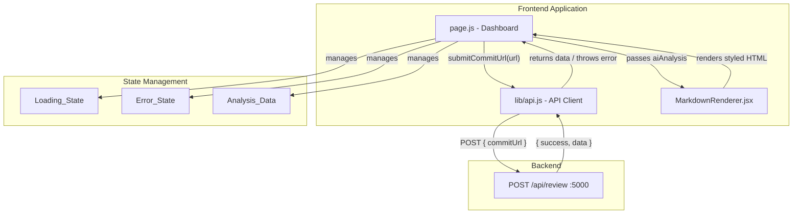
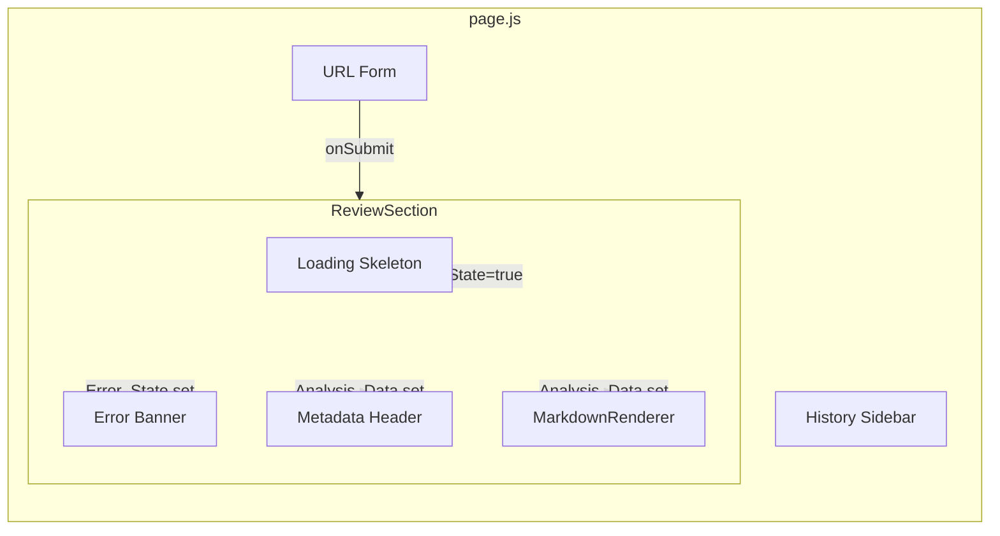
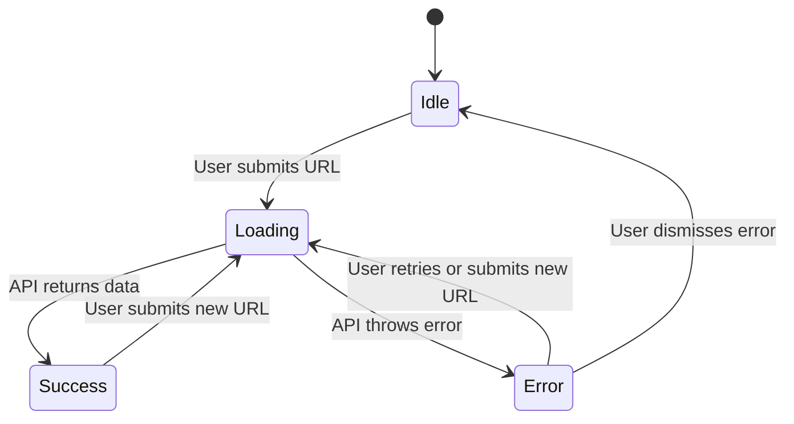

# Design Document: Frontend Commit Analysis

## Overview

This design covers the client-side integration layer for the DevTracks commit analysis dashboard. It connects the existing homepage form to the backend `POST /api/review` endpoint through a centralized API client, manages UI state transitions (idle → loading → success/error), and renders the AI-generated markdown review with dark-themed styling using `react-markdown` and `remark-gfm`.

The implementation touches three files: a new API client module (`lib/api.js`), a new markdown rendering component (`components/MarkdownRenderer.jsx`), and an enhanced page component (`app/page.js`) that wires everything together with proper state management, accessibility, and error handling.

## Architecture



### Component Relationship Diagram



### State Machine



## Components and Interfaces

### Component 1: API Client (`frontend/src/lib/api.js`)

**Purpose**: Centralized HTTP client that encapsulates all communication with the backend API.

**Interface**:
```javascript
/**
 * Submits a GitHub commit URL for AI analysis.
 * @param {string} commitUrl - Full GitHub commit URL
 * @returns {Promise<AnalysisData>} The review data object
 * @throws {Error} With user-friendly message on failure
 */
export async function submitCommitForReview(commitUrl) { /* ... */ }
```

**Configuration**:
```javascript
const API_BASE_URL = process.env.NEXT_PUBLIC_API_URL || 'http://localhost:5000';
```

**Behavior**:
- Sends `POST` to `${API_BASE_URL}/api/review` with JSON body `{ commitUrl }`
- On `success: true` response → returns `data` object
- On `success: false` response → throws `Error` with the `error` string from response
- On network failure → throws `Error` with message "Unable to connect to the analysis service. Check your connection and try again."
- Sets `Content-Type: application/json` header

### Component 2: MarkdownRenderer (`frontend/src/components/MarkdownRenderer.jsx`)

**Purpose**: Renders raw markdown text into styled HTML elements consistent with the dark theme.

**Interface**:
```jsx
/**
 * @param {Object} props
 * @param {string} props.content - Raw markdown string to render
 * @returns {JSX.Element | null} Rendered markdown or null if content is empty
 */
export default function MarkdownRenderer({ content }) { /* ... */ }
```

**Dependencies**:
- `react-markdown` — Markdown-to-React renderer
- `remark-gfm` — GitHub Flavored Markdown plugin (tables, strikethrough, task lists)

**Custom Component Overrides**:
| Element | Tailwind Classes |
|---------|-----------------|
| `h1` | `text-2xl font-bold text-white mt-6 mb-3` |
| `h2` | `text-xl font-semibold text-white mt-5 mb-2` |
| `h3` | `text-lg font-medium text-gray-100 mt-4 mb-2` |
| `h4`–`h6` | `text-base font-medium text-gray-200 mt-3 mb-1` |
| `p` | `text-gray-300 leading-relaxed mb-3` |
| `code` (inline) | `bg-gray-800 text-indigo-300 px-1.5 py-0.5 rounded text-sm font-mono` |
| `pre > code` (block) | `block bg-gray-950 border border-gray-800 rounded-lg p-4 overflow-x-auto text-sm font-mono text-gray-300` |
| `ul` | `list-disc list-inside space-y-1 text-gray-300 mb-3 ml-4` |
| `ol` | `list-decimal list-inside space-y-1 text-gray-300 mb-3 ml-4` |
| `a` | `text-indigo-400 hover:text-indigo-300 underline` |
| `strong` | `font-semibold text-white` |
| `em` | `italic text-gray-200` |
| `blockquote` | `border-l-4 border-indigo-500 pl-4 italic text-gray-400 my-3` |
| `table` | `w-full border-collapse border border-gray-700 my-4` |
| `th` | `border border-gray-700 bg-gray-800 px-3 py-2 text-left text-sm font-medium text-gray-200` |
| `td` | `border border-gray-700 px-3 py-2 text-sm text-gray-300` |

**Null Handling**: Returns `null` when `content` is falsy (undefined, null, empty string).

### Component 3: Enhanced Dashboard (`frontend/src/app/page.js`)

**Purpose**: Orchestrates form submission, state management, and conditional rendering of loading/error/success states.

**State Variables**:
```javascript
const [url, setUrl] = useState('');
const [isLoading, setIsLoading] = useState(false);
const [error, setError] = useState(null);        // string | null
const [reviewData, setReviewData] = useState(null); // AnalysisData | null
const [isCached, setIsCached] = useState(false);
```

**Conditional Rendering Logic**:
```
IF isLoading → show LoadingSkeleton
ELSE IF error → show ErrorBanner with dismiss/retry
ELSE IF reviewData → show MetadataHeader + MarkdownRenderer
ELSE → show placeholder prompt
```

## Data Models

### AnalysisData (Frontend representation)

```typescript
interface AnalysisData {
  _id: string;
  repoName: string;      // "owner/repo"
  commitSha: string;     // 40-char hex
  author: string;
  aiAnalysis: string;    // Raw markdown from Grok
  createdAt: string;     // ISO date string
}
```

### API Response Shape

```typescript
// Success
interface SuccessResponse {
  success: true;
  data: AnalysisData;
  cached?: boolean;
}

// Error
interface ErrorResponse {
  success: false;
  error: string;
}
```

### UI State Model

```typescript
interface DashboardState {
  url: string;           // Current input value
  isLoading: boolean;    // Request in flight
  error: string | null;  // Error message or null
  reviewData: AnalysisData | null;  // Last successful result
  isCached: boolean;     // Whether last result was from cache
}
```

**State Transition Rules**:
| Trigger | isLoading | error | reviewData | isCached |
|---------|-----------|-------|------------|----------|
| Submit | `true` | `null` | `null` | `false` |
| Success (new) | `false` | `null` | `{data}` | `false` |
| Success (cached) | `false` | `null` | `{data}` | `true` |
| Failure | `false` | `"msg"` | `null` | `false` |
| Dismiss error | `false` | `null` | (unchanged) | (unchanged) |


## Correctness Properties

*A property is a characteristic or behavior that should hold true across all valid executions of a system — essentially, a formal statement about what the system should do. Properties serve as the bridge between human-readable specifications and machine-verifiable correctness guarantees.*

### Property 1: State transition consistency

*For any* non-empty URL string submitted through the form, the Dashboard state SHALL transition through a consistent sequence: immediately after submit, `isLoading` is `true`, `error` is `null`, and `reviewData` is `null`; after the API resolves successfully with any valid `AnalysisData` object, `isLoading` is `false` and `reviewData` equals the returned data; after the API rejects with any error message, `isLoading` is `false` and `error` contains that message.

**Validates: Requirements 1.2, 1.3, 1.4**

### Property 2: API client response mapping

*For any* response object from the backend where `success` is `true` and `data` contains an arbitrary `AnalysisData` object, `submitCommitForReview` SHALL return that exact `data` object. *For any* response object where `success` is `false` and `error` contains an arbitrary non-empty string, `submitCommitForReview` SHALL throw an Error whose message includes that string.

**Validates: Requirements 2.3, 2.4**

### Property 3: Error message display passthrough

*For any* non-empty error string stored in `Error_State`, the Dashboard SHALL render that exact string within a visible error container element in the Review_Output section.

**Validates: Requirements 1.5, 3.1**

### Property 4: Form-to-API delegation

*For any* non-empty string entered in the URL input field, when the form is submitted, the Dashboard SHALL call `submitCommitForReview` with that exact string as the argument.

**Validates: Requirements 2.2**

### Property 5: Markdown element rendering

*For any* markdown string containing a heading (levels 1–6), fenced code block, inline code, unordered list, ordered list, bold text, italic text, or link, the Markdown_Renderer SHALL produce output containing the corresponding HTML element (`h1`–`h6`, `pre > code`, `code`, `ul > li`, `ol > li`, `strong`, `em`, `a`).

**Validates: Requirements 4.1, 4.2, 4.3, 4.4, 4.6**

### Property 6: Metadata display completeness

*For any* `AnalysisData` object with arbitrary `repoName`, `commitSha` (40 hex chars), and `author` values, when displayed in the success state, the Dashboard SHALL render the full `repoName`, the first 7 characters of `commitSha`, and the full `author` string in the metadata section.

**Validates: Requirements 6.1, 6.2**

## Error Handling

### Strategy

Errors are handled at two layers:

1. **API Client layer** (`lib/api.js`): Catches HTTP and network errors, normalizes them into thrown `Error` objects with user-friendly messages.
2. **Dashboard layer** (`page.js`): Catches errors from the API client, stores them in `Error_State`, and renders them in an error banner with dismiss/retry actions.

### Error Scenarios

| Source | Condition | User-Facing Message | Recovery |
|--------|-----------|-------------------|----------|
| API Client | Response `success: false` | Backend error message (passed through) | Retry button |
| API Client | Network failure / timeout | "Unable to connect to the analysis service. Check your connection and try again." | Retry button |
| API Client | Non-JSON response | "Received an unexpected response from the server." | Retry button |
| Dashboard | Empty URL submitted | Form validation prevents submission (button disabled) | User enters URL |

### Error Banner Component (inline in page.js)

```jsx
// Rendered when error state is set
<div role="alert" className="rounded-lg border border-red-800/50 bg-red-950/50 p-4">
  <div className="flex items-start gap-3">
    <AlertCircle className="h-5 w-5 text-red-400 shrink-0 mt-0.5" />
    <div className="flex-1">
      <p className="text-sm text-red-200">{error}</p>
    </div>
    <div className="flex gap-2">
      <button onClick={handleRetry} className="text-sm text-indigo-400 hover:text-indigo-300">
        Retry
      </button>
      <button onClick={() => setError(null)} className="text-sm text-gray-400 hover:text-gray-300">
        Dismiss
      </button>
    </div>
  </div>
</div>
```

### Retry Behavior

The retry action re-submits the last URL that was attempted. This requires storing the last submitted URL separately from the input field value (since the user may have edited the input after a failure).

## Testing Strategy

### Unit Testing

**Framework**: Vitest + React Testing Library (consistent with Vite-based project)

**API Client tests** (`lib/api.test.js`):
- Mock `fetch` globally
- Test success response extraction
- Test error response throwing
- Test network failure handling
- Test request body shape and headers

**MarkdownRenderer tests** (`components/MarkdownRenderer.test.jsx`):
- Test each element type renders correctly
- Test empty/null/undefined content returns null
- Test emoji passthrough
- Test GFM features (tables, task lists)

**Dashboard integration tests** (`app/page.test.js`):
- Test form submission triggers API call
- Test loading state shows skeleton
- Test success state shows metadata + rendered markdown
- Test error state shows error banner
- Test dismiss clears error
- Test retry re-submits

### Property-Based Testing

**Library**: fast-check (with Vitest)

**Configuration**: Minimum 100 iterations per property test.

Each property test is tagged with:
```
// Feature: frontend-commit-analysis, Property N: [property text]
```

**Property tests to implement**:
1. State transition consistency — generate random URLs and mock responses, verify state machine rules hold
2. API client response mapping — generate random AnalysisData and error strings, verify correct return/throw behavior
3. Error message display passthrough — generate random error strings, verify they appear in rendered DOM
4. Form-to-API delegation — generate random non-empty strings, verify API called with exact value
5. Markdown element rendering — generate random text, wrap in various markdown syntaxes, verify correct HTML elements produced
6. Metadata display completeness — generate random repoName/commitSha/author, verify all appear in output

### Test File Structure

```
frontend/src/
├── lib/
│   ├── api.js
│   └── api.test.js
├── components/
│   ├── MarkdownRenderer.jsx
│   └── MarkdownRenderer.test.jsx
└── app/
    ├── page.js
    └── page.test.js
```

## Dependencies

| Package | Version | Purpose | Status |
|---------|---------|---------|--------|
| `react-markdown` | `^9.0.0` | Markdown-to-React rendering | New — install |
| `remark-gfm` | `^4.0.0` | GFM support (tables, strikethrough) | New — install |
| `lucide-react` | `^1.16.0` | Icons (AlertCircle, Loader2, etc.) | Already installed |
| `fast-check` | `^3.0.0` | Property-based testing | New — dev dependency |
| `vitest` | `^3.0.0` | Test runner | New — dev dependency |
| `@testing-library/react` | `^16.0.0` | React component testing | New — dev dependency |
| `@testing-library/jest-dom` | `^6.0.0` | DOM assertion matchers | New — dev dependency |
| `jsdom` | `^25.0.0` | DOM environment for tests | New — dev dependency |

**Install commands**:
```bash
npm install react-markdown remark-gfm
npm install -D fast-check vitest @testing-library/react @testing-library/jest-dom jsdom
```
